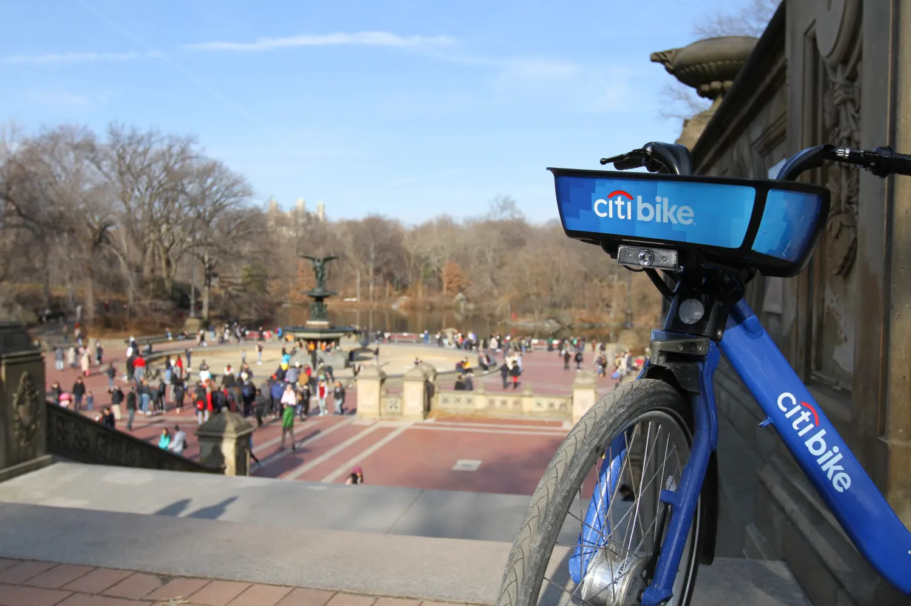

# Data_Analysis_NYCitiBike
Data Analysis of NY Citi Bike for a project using Excel and google docs

## Index:

- [Scenario](#scenario)
- [Objective](#objective)
- [First approach](#first-approach)
- [Procedure](#procedure)
-	[Conclusions](#conclusions)
-	[Proposed actions](#proposed-actions)
- [Presentation](#presentation)
-	[Contact](#contact) 

## Scenario

Citi Bike is the nation's largest bike share program, with 25,000 bikes and over 1,500 stations across Manhattan, Brooklyn, Queens, the Bronx, Jersey City and Hoboken. It is designed with convenience in mind for quick trips, Citi Bike is a fun and affordable way to get around town as stated on their website. You can sign on their website for access to their application and select the plan of your choice including Annual membership, and one-time user pass. The experience with Citi Bike is as simple as join, unlock, ride, and return the bike.
Citi Bike is always looking for improvement of their business, and through the application they collect a load of useful data that after analized we can get a lot of insights and use it to plan and make important decisions for their business.

## Objective

Our main goal is to better understand how the NY Citi Bike’s customer base use this business, including one-time users and long term subscribers. 
This will help us to select the 5 top stations to recommend actions on them, and propose a market campaign to target the most important different customer segments.

## First approach

Our main audience will be business stakeholders who work at NY Citi Bike. This will include representatives from the marketing, sales, product, and customer service departments. The data will show them how people use the Citi Bike services, and will allow them to deliver more effective, targeted market campaigns and to plan where to install more bikes.
We will work our analysis through this questions in order to present the results to the audience:
- What are the most popular pick-up locations across the city for NY Citi Bike rental?
- How does the average trip duration vary across different age groups?
- Which age group rents the most bikes?
- How does bike rental vary across the two user groups (one-time users vs long-term subscribers) on different days of the week?
- Does user age impact the average bike trip duration?

Excel was used to organize this first approach. To explore this table, follow this [link](https://docs.google.com/spreadsheets/d/1oqWlSLKPg0_O1UY6g2VYYs94ZONzoD-4xBjYpxisGH4/edit?usp=sharing)

## Procedure

This dataset was sourced from a free data site: Kaggle.com and customized it by CareerFoundry to fit the scope of this project. We have to do some cleanning of the  dataset and prep it for analysis, but nothing complicated since it was almost clean. We open the Excel file selected all data and removed duplicates. After that we dealt with the empty rows using filters and removing those, finally we took care of the missing values using same procedure for every column and ending with a clean dataset.
We then continued with the exploratory data analysis, used descriptivive estatistics, and created different pivot tables to get some results and insigts.
Finally using those pivot tables we created vizualizations of our findings, and created a scatter plot looking for some correlation to respond our last question.
With all those charts in hand we were able to communicate in a simple way a response to our questions, and proposed some actions to take based on our findings.

Excel was used to Analyze this dataset. To explore this work, follow this [link](https://docs.google.com/spreadsheets/d/1uePgXJGjckMsCYl1p4EpJ7I4j5tmK-QWfv_zjBSfyXQ/edit?usp=sharing)

## Conclusions

- The Top 5 pick-up stations are:
  - Grove St Path, Exchange Place, Sip Ave, Hamilton Park, Morris Canal.
- Most NY Citi Bike users are long-term subscribers.
- Subscribers are more active during the week.
- 35-44 year olds group rented the most bikes.
- Citi Bike customer behavior shows:
  - 75+ year olds group take longest average trips, but rent the least bikes.
  - 65-74 & 45-54 year olds groups take the shortest trips on average.
  - One-time users are more active on weekends.
- Finally, data shows that there’s not relationship between user age and trip duration.

## Proposed actions

- Install more bikes on the 5 Top pick-up locations:
  - Grove St Path, Exchange Place, Sip Ave, Hamilton Park, Morris Canal.
- Marketing and advertising campaign should be targeting long term subscribers in the group of 35-44 year olds. This group is more active during the week.

## Presentation

We used Google slide for storytelling to make our presentation as a simple and visually appealing tools. To view our presentation, follow the [link](https://docs.google.com/presentation/d/e/2PACX-1vTYuAAVZBK1Rs_pM58I5RIR6EOsiDE4bvHZYJy5jqeX6qOa4IVr849QJKhuNG6c2gWHRyHhnepLYG_G/pub?start=true&loop=false&delayms=3000)

## Contact

Luis R Guerrero - @lrgutube09 - lrgutube09@gmail.com

Project Link: https://github.com/GitHub4lrg/Data_Analysis_NYCitiBike
